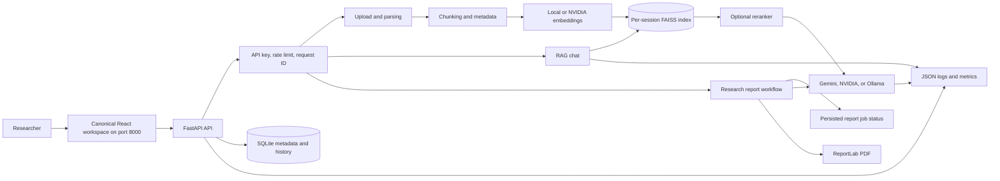

# Architecture

## Request path

1. Middleware accepts or creates an `X-Request-ID`, enforces rate limits, and records latency.
2. Uploads are sanitized, parsed, chunked, embedded, and stored in a session-scoped FAISS index.
3. Chat retrieves more candidates than it returns, optionally reranks them, and refuses generation when no context exists.
4. Provider calls record model, latency, estimated tokens, and configurable estimated cost without logging prompts.
5. `/api/v1/metrics` exposes process-local request, retrieval, and provider summaries behind the same optional API key as other API routes.

## Security boundaries

- Uploaded filenames and session IDs are normalized before filesystem access.
- CORS origins are explicit and credentials are disabled for wildcard origins.
- API-key authentication is optional for local development and enabled by setting `API_AUTH_TOKEN`.
- Report downloads require both the session ID and report ID, and paths are constrained to the reports directory.
- Container builds exclude `.env` files and runtime data.
- Retrieval traces fingerprint queries instead of logging raw user text.
- Vector metadata is JSON, avoiding unsafe pickle deserialization.

## Deliberate MVP tradeoffs

- SQLite, local files, in-memory rate limits, and process-local metrics suit a single-node demo, not horizontal scaling.
- Report workers are process-local threads with SQLite recovery; production multi-node deployment requires an external queue.
- FAISS indexes are scoped by session but do not implement multi-tenant authorization.
- Token and cost values are provider-independent estimates unless exact usage is added from provider responses.
- The deterministic faithfulness metric is a regression signal, not a substitute for human review.
