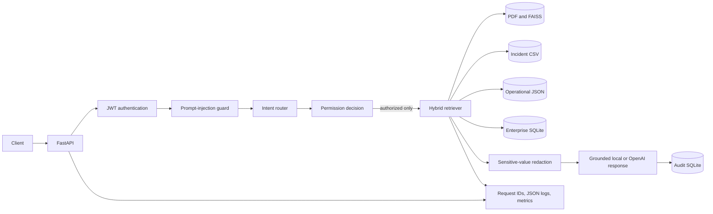

# Architecture

## Authorization boundary

Authorization is applied before retrieval. The router determines candidate source types and required permissions, then the role permission set limits every retriever. Unauthorized records are never passed to response generation.

## Audit and observability

- Audit rows persist user, role, query, source names, outcome, and security flags.
- Runtime logs include request ID, route, status, latency, role, authorized source count, and a query fingerprint rather than raw query text.
- `/metrics` is restricted to Admin and Compliance and reports process-local request, retrieval, and query-outcome counters.

## Deployment tradeoffs

- The three SQLite databases and process-local metrics are appropriate for a single-node portfolio deployment.
- Multi-instance production should use managed relational storage, centralized telemetry, migrations, and a shared vector database.
- Demo credentials and seeding must be disabled outside controlled demo environments.
